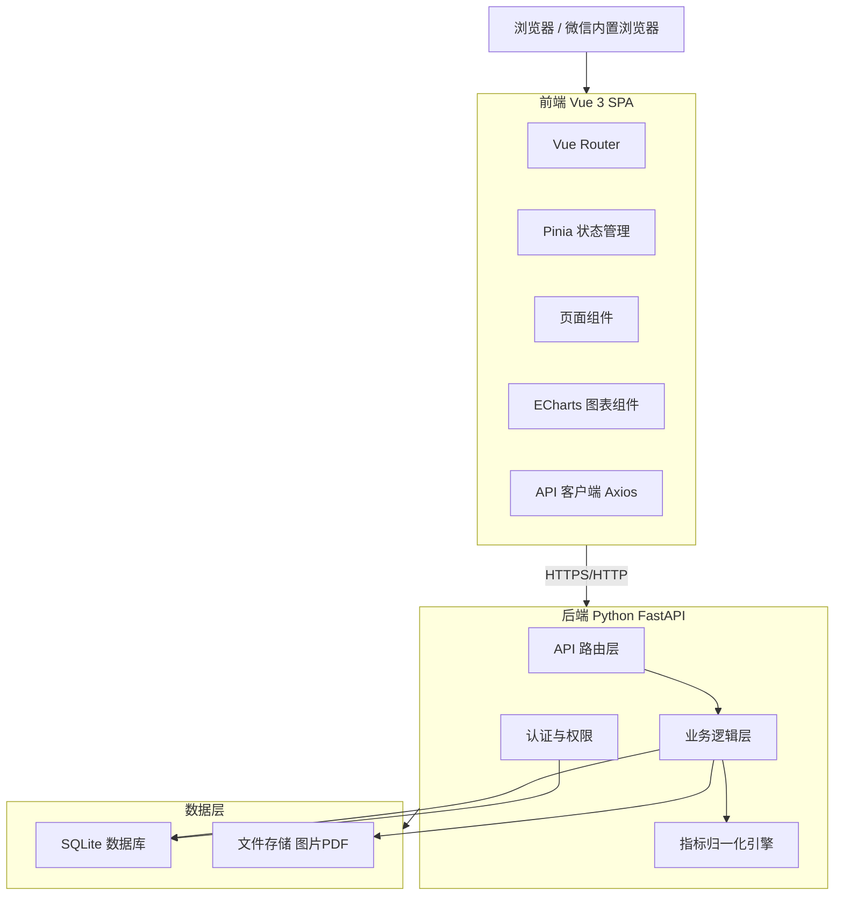
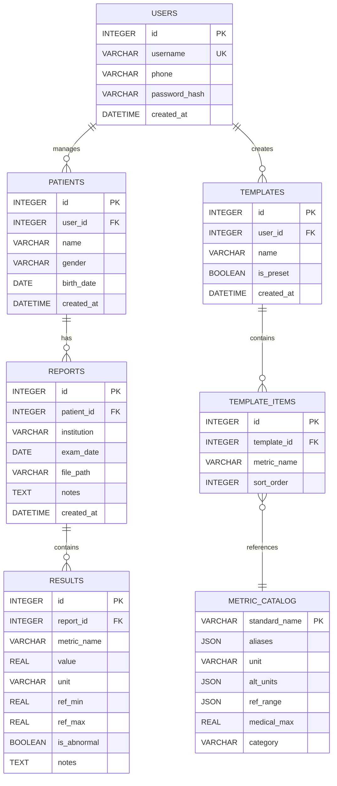

# 患者检查报告趋势分析系统 技术设计

Feature Name: patient-report-trend-analyzer
Updated: 2026-06-12

## Description

患者检查报告趋势分析系统是一个面向个人和家庭的数字健康管理 Web 应用。系统采用前后端分离架构，前端使用 Vue 3 构建响应式界面，后端使用 Python (FastAPI) 提供 RESTful API。系统部署于用户自有 PC，支持 7x24 小时运行。首期以人工快捷录入为核心，OCR识别功能标记为 P2 延后实现。

## Architecture



### 架构说明

- **前端**: Vue 3 + TypeScript + Vite + Pinia + Vue Router + ECharts + Element Plus
- **后端**: Python 3.11+ + FastAPI + SQLAlchemy (async) + Pydantic
- **数据库**: MySQL 8.0+（支持后续扩展和多设备同步）
- **ORM**: SQLAlchemy (async) + Alembic 迁移管理
- **文件存储**: 本地文件系统（原始报告图片/PDF）
- **通信**: RESTful JSON API，开发环境通过 Vite proxy 转发

## Components and Interfaces

### 前端组件结构

```
src/
├── views/
│   ├── LoginView.vue           # 登录/注册页
│   ├── DashboardView.vue       # 个人仪表板
│   ├── TrendView.vue           # 趋势图详情页
│   ├── ReportListView.vue      # 报告库页
│   └── EntryView.vue           # 录入页（核心）
├── components/
│   ├── PatientSelector.vue     # 患者切换选择器
│   ├── MetricSearchInput.vue   # 智能指标搜索输入
│   ├── TrendChart.vue          # ECharts 趋势图封装
│   ├── BatchEntryForm.vue      # 批量连续录入表单
│   ├── AnomalyBadge.vue        # 异常标记组件
│   └── ShareDialog.vue         # 分享弹窗
├── stores/
│   ├── auth.ts                 # 认证状态
│   ├── patient.ts              # 当前患者上下文
│   └── metrics.ts              # 指标库缓存
├── api/
│   ├── client.ts               # Axios 实例配置
│   ├── auth.ts                 # 认证相关 API
│   ├── patients.ts             # 患者管理 API
│   ├── reports.ts              # 报告管理 API
│   └── metrics.ts              # 指标数据 API
└── utils/
    ├── unitConverter.ts        # 单位换算工具
    ├── chartConfig.ts          # ECharts 默认配置
    └── validators.ts           # 输入校验规则
```

### 后端模块结构

```
backend/
├── main.py                     # FastAPI 应用入口
├── config.py                   # 配置管理
├── database.py                 # 数据库连接
├── models/
│   ├── user.py                 # 用户模型
│   ├── patient.py              # 患者模型
│   ├── report.py               # 报告模型
│   └── result.py               # 检查结果模型
├── schemas/
│   ├── user.py                 # 用户 Pydantic 模型
│   ├── patient.py              # 患者 Pydantic 模型
│   ├── report.py               # 报告 Pydantic 模型
│   └── result.py               # 结果 Pydantic 模型
├── routers/
│   ├── auth.py                 # 认证路由
│   ├── patients.py             # 患者路由
│   ├── reports.py              # 报告路由
│   ├── results.py              # 结果路由
│   └── metrics.py              # 指标库路由
├── services/
│   ├── auth_service.py         # 认证业务逻辑
│   ├── normalization.py        # 指标归一化服务
│   └── trend_service.py        # 趋势数据计算
└── core/
    ├── security.py             # 密码哈希、JWT
    └── validators.py           # 医学范围校验
```

### API 接口清单

| 方法 | 路径 | 描述 | 鉴权 |
|------|------|------|------|
| POST | `/api/auth/register` | 用户注册 | 否 |
| POST | `/api/auth/login` | 用户登录 | 否 |
| GET | `/api/patients` | 获取患者列表 | 是 |
| POST | `/api/patients` | 创建患者档案 | 是 |
| PUT | `/api/patients/{id}` | 更新患者信息 | 是 |
| DELETE | `/api/patients/{id}` | 删除患者档案 | 是 |
| GET | `/api/metrics/catalog` | 获取指标库 | 是 |
| POST | `/api/metrics/custom` | 创建自定义指标 | 是 |
| GET | `/api/reports` | 获取报告列表 | 是 |
| POST | `/api/reports` | 创建报告（含指标） | 是 |
| GET | `/api/reports/{id}` | 获取报告详情 | 是 |
| PUT | `/api/reports/{id}` | 更新报告 | 是 |
| DELETE | `/api/reports/{id}` | 删除报告 | 是 |
| GET | `/api/trends/{metric_name}` | 获取指标趋势数据 | 是 |
| GET | `/api/trends/compare` | 获取对比趋势数据 | 是 |
| POST | `/api/share/generate` | 生成分享链接 | 是 |
| GET | `/api/share/{token}` | 通过分享链接访问 | 否（token鉴权） |
| GET | `/api/dashboard` | 获取仪表板摘要 | 是 |

## Data Models

### 数据库 ER 关系



### 关键表结构

**用户表 users**
| 字段 | 类型 | 约束 | 说明 |
|------|------|------|------|
| id | BIGINT | PK, AUTO_INCREMENT | 主键 |
| username | VARCHAR(50) | UNIQUE, NOT NULL | 手机号 |
| phone | VARCHAR(20) | | 备用联系方式 |
| password_hash | VARCHAR(255) | NOT NULL | bcrypt 哈希 |
| created_at | DATETIME | DEFAULT CURRENT_TIMESTAMP | 注册时间 |

**患者表 patients**
| 字段 | 类型 | 约束 | 说明 |
|------|------|------|------|
| id | BIGINT | PK, AUTO_INCREMENT | 主键 |
| user_id | BIGINT | FK -> users.id, NOT NULL | 所属账号 |
| name | VARCHAR(50) | NOT NULL | 患者姓名 |
| gender | VARCHAR(10) | | 性别 |
| birth_date | DATE | | 出生日期 |
| created_at | DATETIME | DEFAULT CURRENT_TIMESTAMP | 创建时间 |

**报告表 reports**
| 字段 | 类型 | 约束 | 说明 |
|------|------|------|------|
| id | BIGINT | PK, AUTO_INCREMENT | 主键 |
| patient_id | BIGINT | FK -> patients.id, NOT NULL | 所属患者 |
| institution | VARCHAR(100) | NOT NULL | 检查机构 |
| exam_date | DATE | NOT NULL | 检查日期 |
| file_path | VARCHAR(255) | | 原始文件路径 |
| notes | TEXT | | 备注 |
| created_at | DATETIME | DEFAULT CURRENT_TIMESTAMP | 录入时间 |

**检查结果表 results**
| 字段 | 类型 | 约束 | 说明 |
|------|------|------|------|
| id | BIGINT | PK, AUTO_INCREMENT | 主键 |
| report_id | BIGINT | FK -> reports.id, NOT NULL | 所属报告 |
| metric_name | VARCHAR(50) | NOT NULL | 归一化后指标名 |
| value | DECIMAL(10,2) | NOT NULL | 测量值 |
| unit | VARCHAR(20) | NOT NULL | 单位 |
| ref_min | DECIMAL(10,2) | | 参考范围下限 |
| ref_max | DECIMAL(10,2) | | 参考范围上限 |
| is_abnormal | TINYINT(1) | | 是否异常 |
| notes | TEXT | | 单项备注 |

**指标模板表 templates**
| 字段 | 类型 | 约束 | 说明 |
|------|------|------|------|
| id | BIGINT | PK, AUTO_INCREMENT | 主键 |
| user_id | BIGINT | FK -> users.id, NOT NULL | 所属用户 |
| name | VARCHAR(100) | NOT NULL | 模板名称 |
| is_preset | TINYINT(1) | DEFAULT 0 | 是否为预置模板 |
| created_at | DATETIME | DEFAULT CURRENT_TIMESTAMP | 创建时间 |

**模板项目表 template_items**
| 字段 | 类型 | 约束 | 说明 |
|------|------|------|------|
| id | BIGINT | PK, AUTO_INCREMENT | 主键 |
| template_id | BIGINT | FK -> templates.id, NOT NULL | 所属模板 |
| metric_name | VARCHAR(50) | NOT NULL | 指标标准名 |
| sort_order | INT | NOT NULL | 排序序号 |

**指标库表 metric_catalog**
| 字段 | 类型 | 约束 | 说明 |
|------|------|------|------|
| standard_name | VARCHAR(50) | PK | 标准名称 |
| aliases | JSON | | 别名列表 |
| unit | VARCHAR(20) | NOT NULL | 标准单位 |
| alt_units | JSON | | 备选单位及换算公式 |
| ref_range | JSON | | 参考范围（分年龄/性别） |
| medical_max | DECIMAL(10,2) | | 医学最大合理值 |
| category | VARCHAR(50) | | 分类（如"血脂四项"） |

### 预设指标库（JSON 配置 + 数据库表）

系统内置指标库以 JSON 文件形式维护，启动时同步到 `metric_catalog` 表，支持动态扩展：

```json
{
  "metrics": [
    {
      "standard_name": "血糖-空腹",
      "aliases": ["空腹血糖", "FBG", "FPG", "Fasting Blood Glucose"],
      "unit": "mmol/L",
      "alt_units": {"mg/dL": {"factor": 0.0555, "offset": 0}},
      "ref_range": {"default": {"min": 3.9, "max": 6.1}},
      "medical_max": 50,
      "category": "生化检查"
    }
  ],
  "presets": [
    {
      "name": "血脂四项",
      "metrics": ["总胆固醇", "甘油三酯", "高密度脂蛋白胆固醇", "低密度脂蛋白胆固醇"]
    },
    {
      "name": "肝功能全套",
      "metrics": ["谷丙转氨酶", "谷草转氨酶", "总胆红素", "直接胆红素", "间接胆红素", "总蛋白", "白蛋白", "球蛋白", "白球比", "碱性磷酸酶", "谷氨酰转肽酶"]
    }
  ]
}
```

## Correctness Properties

### 数据一致性
- 每个检查结果必须关联到有效的报告，每个报告必须关联到有效的患者
- 指标名称在保存前经过归一化处理，确保同一指标不同别名统一为标准名称
- 异常状态 (`is_abnormal`) 由系统根据 `value` 与 `ref_min/ref_max` 自动计算，不依赖用户输入

### 单位换算正确性
- 单位换算公式为线性变换：`standard_value = raw_value * factor + offset`
- 换算结果保留两位小数精度
- 趋势图仅展示标准单位数据

### 权限隔离
- 用户仅能访问自己创建的 `patients` 记录及其关联数据
- 所有查询自动附加 `WHERE patient.user_id = current_user.id` 条件
- 分享链接通过独立 token 验证，仅授予只读访问

### 数值校验
- 录入数值超过 `medical_max` 阈值时触发二次确认
- 指标名称必须在预设库或用户自定义库中存在

## Error Handling

### 错误分类与处理策略

| 错误类型 | HTTP 状态码 | 用户提示 | 处理方式 |
|----------|-------------|----------|----------|
| 认证失败（未登录） | 401 | "请先登录" | 跳转登录页 |
| 权限不足 | 403 | "无权访问此数据" | 返回仪表板 |
| 数据不存在 | 404 | "报告不存在" | 返回上一页 |
| 输入校验失败 | 422 | 具体字段错误信息 | 表单内联提示 |
| 数值超出医学范围 | 422 | "数值超出合理范围，请确认" | 弹出二次确认 |
| 服务器内部错误 | 500 | "服务暂时不可用" | 记录后端日志 |

### 并发安全
- 使用 MySQL InnoDB 引擎，支持行级锁和事务隔离
- 同一报告的多项结果使用事务批量提交，保证原子性
- 趋势查询使用只读事务，避免阻塞写入

## Test Strategy

### 前端测试
- **单元测试**: Vitest 覆盖工具函数（单位换算、数据校验、归一化匹配）
- **组件测试**: Vue Test Utils 覆盖录入表单、图表渲染、搜索输入组件
- **E2E 测试**: Playwright 覆盖完整用户流程（注册 -> 创建患者 -> 录入指标 -> 查看趋势图）

### 后端测试
- **单元测试**: pytest 覆盖归一化引擎、单位换算、权限检查逻辑
- **集成测试**: pytest + httpx.AsyncClient 测试 API 端点，验证请求响应正确性和状态码
- **数据一致性测试**: 验证 CRUD 操作后数据库状态正确性

### 性能测试
- 单患者 1000 条指标数据下，趋势图渲染时间 < 2 秒
- API 响应时间 P95 < 200ms

## Implementation Plan

### Phase 1: MVP (P0 核心功能)

1. **项目脚手架**: Vue 3 + FastAPI 基础项目结构、认证流程、数据库初始化
2. **患者管理**: 多患者档案 CRUD、患者上下文切换
3. **指标库**: 预设指标库加载、别名归一化、自定义指标
4. **快捷录入**: 智能搜索输入、批量连续录入、预置模板、移动端数字键盘
5. **趋势图**: 单指标折线图、时间范围筛选、异常点标记、线性回归趋势线
6. **仪表板**: 异常指标摘要、最新报告卡片、需关注趋势提示

### Phase 2: 增强功能 (P1)

1. **报告库**: 时间轴报告列表、原始文件预览/下载
2. **分享功能**: 临时链接生成、权限控制、过期失效
3. **趋势图导出**: PNG/PDF 导出、多图对比

### Phase 3: 扩展功能 (P2)

1. **OCR 识别**: 接入第三方 OCR 服务、识别预览与纠错
2. **医生视角**: 医生评论功能、群体正常范围曲线
3. **数据导入**: Excel/CSV 批量导入

## Deployment

### 部署架构（PC 本地）

```
用户 PC (7x24h 运行)
├── MySQL 8.0          :3306
├── Backend Service    Python FastAPI  :8000
├── Frontend Service   Vite Dev Server :5173 (生产用 nginx 托管静态文件)
└── File Storage       uploads/
```

### 数据库配置

```env
# .env
DB_HOST=localhost
DB_PORT=3306
DB_NAME=patient_trend
DB_USER=root
DB_PASSWORD=your_password
DB_CHARSET=utf8mb4
```

### Alembic 迁移管理

```bash
# 初始化迁移
alembic init migrations

# 生成迁移脚本
alembic revision --autogenerate -m "initial schema"

# 执行迁移
alembic upgrade head
```

### 生产部署建议

```bash
# 后端启动
uvicorn backend.main:app --host 0.0.0.0 --port 8000 --workers 1

# 前端构建与托管
npm run build
# 使用 nginx 托管 dist/ 目录并反向代理 /api 到 :8000
```

### Vite 开发环境代理配置

```typescript
// vite.config.ts
export default defineConfig({
  server: {
    host: '0.0.0.0',
    allowedHosts: ['.monkeycode-ai.online'],
    proxy: {
      '/api': {
        target: 'http://localhost:8000',
        changeOrigin: true
      }
    }
  }
})
```

## References

[^1]: (FastAPI) - https://fastapi.tiangolo.com/
[^2]: (Vue 3) - https://vuejs.org/
[^3]: (ECharts) - https://echarts.apache.org/
[^4]: (Element Plus) - https://element-plus.org/
[^5]: (SQLite WAL 模式) - https://www.sqlite.org/wal.html
